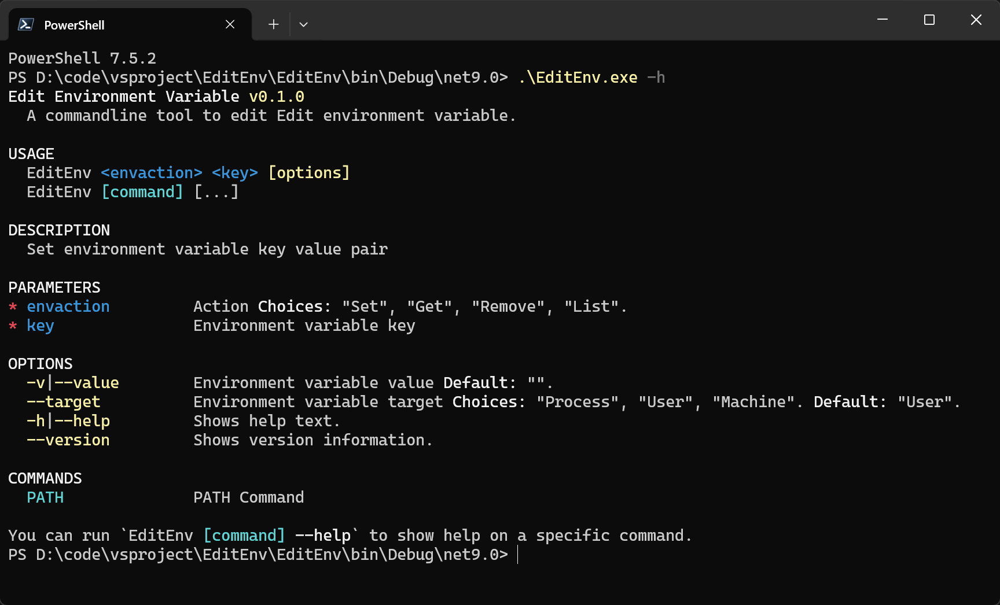

A command line tool to edit Edit environment variable.




## Install

If you have .Net SDK installed on your computer, you can install **EditEnv** by dotnet tool:

```bash
dotnet tool install EditEnv --global
```

or, download the EditEnv.exe , add it's directory to user Path environment variable.


## Usage

Set user environment variable key value pair


```bash
EditEnv set test -v 123

EditEnv set test -v 123456
The Variable key [test] is exist, will you update it? (y/n) y
Set :test = 123456
```

Get user environment variable by key

```bash
EditEnv get test
```

Remove user environment variable by key

```bash
EditEnv remove test
```

---

Add directory to PATH

```bash
EditEnv path add -v D:\code\vsproject\EditEnv

EditEnv path add -v "C:\Program Files\ContextMenuTools\ImageProcess"
EditEnv set test -v 123 --target machine
The Variable key [test] is exist, will you update it? (y/n) y
Set :test = 123

EditEnv remove test --target machine

```

Remove directory from PATH

```bash
EditEnv path remove -v D:\code\vsproject\EditEnv
```

List all directory in PATH

```bash
EditEnv path list
```

---

**To modify system environment variables, you need to open the terminal with administrator privileges.**

```bash
EditEnv set test -v 123 --target machine
```


